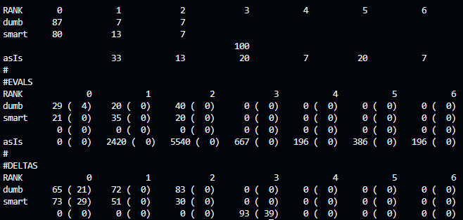
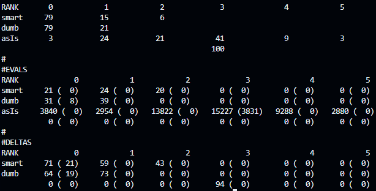

# README: How to run our code & Experiment observations

This guide will help you run the code for the project on GitHub Codespaces, using the `24Aug14` branch. It covers both Part 1 (running a single file) and Part 2 (running experiments over multiple datasets).

Group 1: Sanjit Verma (skverma), Arul Sharma (asharm52), Sarvesh Soma (ssomasu)

## Prerequisites

Ensure you have the correct environment set up for Python 3.13 & Codespaces as per the instructions provided in <https://txt.github.io/se24fall/03code.html#try-it-for-yourself>.

### Setting Up GitHub Codespace

1.  Boot up the GitHub Codespace in the `24Aug14` branch.

2.  Ensure that the correct version of Python (Python 3.13) is available and active in the Codespace.

## Running Part 1: Single File Execution

To run the experiment on a single file from the `/workspaces/ezr` directory, use the following command:

```bash
python3.13 -B homework3/extend_hw3.py -t data/optimize/{folder_name}/{file_name}
```

Replace `{folder_name}` and `{file_name}` with the actual folder and file you want to test.


## Running Part 2: Running Experiments Over Many Datasets

### Step 1: Sorting Files by Dimension

To run the experiments over multiple datasets, you first need to sort the files into high and low dimensions. Use the following script to sort the files:

1.  Navigate to the `homework3` directory.

2.  Run script named `sort.sh`. It will go throughs all the files in `data/optimize` and filter them for high or low. Run the script by navigating to the `/workspaces/ezr/homework3` directory and executing the following command:

    ```bash
    bash sort.sh
    ```

3.  This will generate a folder called `sortedFiles` inside `homework3`, with two subfolders: `high` and `low`

### Step 2: Running the Experiments

Once the files are sorted, run the `runExperiments.sh` script in the `homework3` directory, which queues up all tasks for both high and low dimension files. This will take between 10 and 30 minutes. 

This script automatically outputs the task results to the `/workspaces/ezr/tmp` directory, which will contain two subfolders: `high` and `low`, storing all the experiment data

### Step 3: Generating Final Tables

After the experiments are complete, you can generate the final tables by running the `run_rqsh.sh` script:

1.  run the script `run_rqsh.sh` inside the `/workspaces/ezr/homework3` directory 
2.  select opption for either high or low


## Results

### Low Dimensional


In our low-dimensional experiment, as seen in the table above, we compared the performance of the two strategies the dumb (random guessing) method and the smart (calculated). Interestingly we saw, in the RANK section that the dumb method dominates Rank 0 with 87 occurrences, while the smart method follows closely with 80 occurrences. However, as the ranks increased the smart method showed more prominence, particularly at Rank 1, where it surpassed the dumb method (13 vs 7). The asIs row showed how the untreated dataset is distributed across ranks, offering a baseline to compare the methods against. In the EVALS section, the evaluations reveal that the dumb method was tested more frequently at lower ranks, while the smart method weas in higher ranks. Notably, the DELTAS section indicates that both methods significantly improve over the baseline, with the smart method showing a 73% improvement at Rank 0, compared to 65% for the dumb method. These results highlight the effectiveness of both strategies in low dim data, with random guessing holding its own at lower ranks but the smart method showing stronger performance as complexity increases.

### High Dimensional


The high dim experiment, shown in the table above, also evaluated the performance of the two approaches but with data sets greater than 6 independent values. At Rank 0, both methods were tied, each with 79 occurrences. However, at Rank 1, the dumb method led with 21 occurrences compared to the smart methods 15. At Rank 2, the smart method gained an edge, being the only one with any occurrences (6), while the dumb method dropped off. The asIs row showed how the untreated dataset was distributed across different ranks, serving as a reference point for evaluating the results. The EVALS section indicated that both methods were heavily tested at lower ranks, with the smart method still active at Rank 2. The DELTAS section revealed a notable improvement for both methods over the baseline. At Rank 0, the smart method showed a 71% improvement, slightly outperforming the dumb method’s 64%. As the ranks increased, the smart method continued to perform better, suggesting that calculated approaches were more effective in handling high-dimensional data, where random guessing began to falter.

## Discussion
Since we observed that the dumb  method dominated at Rank 0 for low-dimensional problems and was nearly as effective as the smart method at higher ranks, we confirmed the JJR1 hypothesis that "nothing works better than 50 random guesses for low-dimensional problems." We agreed from our data that the random guessing approach holds its ground in simpler low-dimensional data where complexity is minimal, and calculated methods do not offer a significant advantage.

However, in the high-dimensional experiment, the smart method consistently outperformed the dumb method as the rank increased. At Rank 2 and beyond, the dumb method completely fell off, while the smart method continued to show improvements. Based on these observations, we alsi confirmed JJR2’s hypothesis that random guessing becomes ineffective as the dimensionality of the data increases. Therefore, random guessing is indeed bad for higher-dimensional problems, and calculated methods become more necessary to handle the increased complexity effectively.

While the results support the hypotheses, there are some potential sources of error. The dumb method's randomness may cause variability across runs, and the smart method assumes optimal scoring, which may not hold in noisy or incomplete datasets. Finally, dataset shuffle consistency could be a concern as it might not be sufficiently random if repeated multiple times under similar conditions. These are some  issues we thought of within our code which may have resulted in some inconsistency. 
